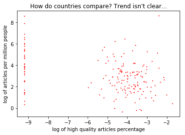

# data-512-a2
Data 512 A2 Assignment -- Bias on Wikipedia

This ipython notebook is created for DATA512 at UW for this assignment: https://wiki.communitydata.cc/HCDS_(Fall_2017)/Assignments#A2:_Bias_in_data

Our goal is to analyze the content of wikipedia to understand the biases of the site by looking at the content coverage for political members of countries. We look at how many pages there are (as a percent of the country's population) and how many of the pages are high quality (using scores from the ORES system, more info below).

In the end, we show the top/bottom 10 countries for these 2 categories.

## Related Data Files

raw data files:
- page_data.csv : raw wikipedia data
- WPDS_2018_data.csv : raw country population data

Output files:
- ores_data.csv : articles scores from the ORES system
- combined_data.csv : combined data (country population, ores data and wikipedia data)

Data comes from a few different sources. Wikipedia data is available via figshare (https://figshare.com/articles/Untitled_Item/5513449 , under country/data/) with license CC-BY-SA 4.0. This contains "most English-language Wikipedia articles within the category 'Category:Politicians by nationality' and subcategories". This data contains 3 columns, which are called out in the above link as follows:

1. "country", containing the sanitised country name, extracted from the category name;
2. "page", containing the unsanitised page title.
3. "last_edit", containing the edit ID of the last edit to the page.

Population data is available via https://www.dropbox.com/s/5u7sy1xt7g0oi2c/WPDS_2018_data.csv?dl=0.
This file contains the population in millions from mid-2018 along with the country name.

A copy of the datasets, downloaded in oct, 2018, are available in this repo.

<table border="1" class="dataframe">
  <thead>
    <tr style="text-align: right;">
      <th></th>
      <th>page</th>
      <th>country</th>
      <th>rev_id</th>
    </tr>
  </thead>
  <tbody>
    <tr>
      <th>0</th>
      <td>Template:ZambiaProvincialMinisters</td>
      <td>Zambia</td>
      <td>235107991</td>
    </tr>
    <tr>
      <th>1</th>
      <td>Bir I of Kanem</td>
      <td>Chad</td>
      <td>355319463</td>
    </tr>
    <tr>
      <th>2</th>
      <td>Template:Zimbabwe-politician-stub</td>
      <td>Zimbabwe</td>
      <td>391862046</td>
    </tr>
    <tr>
      <th>3</th>
      <td>Template:Uganda-politician-stub</td>
      <td>Uganda</td>
      <td>391862070</td>
    </tr>
    <tr>
      <th>4</th>
      <td>Template:Namibia-politician-stub</td>
      <td>Namibia</td>
      <td>391862409</td>
    </tr>
  </tbody>
</table>

Here are the first few rows of the population data

<table border="1" class="dataframe">
  <thead>
    <tr style="text-align: right;">
      <th></th>
      <th>Geography</th>
      <th>population</th>
    </tr>
  </thead>
  <tbody>
    <tr>
      <th>0</th>
      <td>AFRICA</td>
      <td>1284.0</td>
    </tr>
    <tr>
      <th>1</th>
      <td>Algeria</td>
      <td>42.7</td>
    </tr>
    <tr>
      <th>2</th>
      <td>Egypt</td>
      <td>97.0</td>
    </tr>
    <tr>
      <th>3</th>
      <td>Libya</td>
      <td>6.5</td>
    </tr>
    <tr>
      <th>4</th>
      <td>Morocco</td>
      <td>35.2</td>
    </tr>
  </tbody>
</table>

We created a helper function for getting ores scores (more info in the notebook). ORES (Objective Revision Evaluation Service) is a machine learning service that ranks the quality of a given article. The ranks go from best to worst as FA, GA, B, C, Start and Stub. For the purposes of this analysis, we use only the predicted category (rather than the probabilities, which are also available).
link with more info: https://www.mediawiki.org/wiki/ORES

We convert the ores_data into a pandas dataframe and save to a csv for reference. This is ores_data.csv.

Here are a few example rows of the output:

<table border="1" class="dataframe">
  <thead>
    <tr style="text-align: right;">
      <th></th>
      <th>revision_id</th>
      <th>article_quality</th>
    </tr>
  </thead>
  <tbody>
    <tr>
      <th>0</th>
      <td>355319463</td>
      <td>Stub</td>
    </tr>
    <tr>
      <th>1</th>
      <td>391862046</td>
      <td>Stub</td>
    </tr>
    <tr>
      <th>2</th>
      <td>391862070</td>
      <td>Stub</td>
    </tr>
    <tr>
      <th>3</th>
      <td>391862409</td>
      <td>Stub</td>
    </tr>
    <tr>
      <th>4</th>
      <td>391862819</td>
      <td>Stub</td>
    </tr>
  </tbody>
</table>

We then merge the wikipedia data to the ores data on the revision id. We also merge onto the country data on the country/geography columns. There are 44,973 rows left after we inner join.

Here is a preview of the US data:

<table border="1" class="dataframe">
  <thead>
    <tr style="text-align: right;">
      <th></th>
      <th>page</th>
      <th>country</th>
      <th>rev_id</th>
      <th>Geography</th>
      <th>population</th>
      <th>revision_id</th>
      <th>article_quality</th>
    </tr>
  </thead>
  <tbody>
    <tr>
      <th>26912</th>
      <td>Butler-Belmont family</td>
      <td>United States</td>
      <td>470173494</td>
      <td>United States</td>
      <td>328.0</td>
      <td>470173494</td>
      <td>Start</td>
    </tr>
    <tr>
      <th>26913</th>
      <td>Heard-Hawes family</td>
      <td>United States</td>
      <td>502721672</td>
      <td>United States</td>
      <td>328.0</td>
      <td>502721672</td>
      <td>C</td>
    </tr>
    <tr>
      <th>26914</th>
      <td>Russell family (American political family)</td>
      <td>United States</td>
      <td>550953646</td>
      <td>United States</td>
      <td>328.0</td>
      <td>550953646</td>
      <td>Stub</td>
    </tr>
    <tr>
      <th>26915</th>
      <td>Read family of Delaware</td>
      <td>United States</td>
      <td>651856758</td>
      <td>United States</td>
      <td>328.0</td>
      <td>651856758</td>
      <td>Start</td>
    </tr>
    <tr>
      <th>26916</th>
      <td>Template:US-politician-stub</td>
      <td>United States</td>
      <td>666834672</td>
      <td>United States</td>
      <td>328.0</td>
      <td>666834672</td>
      <td>Stub</td>
    </tr>
  </tbody>
</table>

We filter the new dataset to remove duplicate columns and save this to a csv. This is the combined_data.csv.

## Analysis

Here we start analyzing the data. We aggregate everything up to the country level, of which there are 180. Once we merge the high quality articles, the wikipedia data and the country data, we are left with 143 countries. The list of 37 countries with no high quality articles are located at the end of this analysis.

We calculate the articles_per_population (which is per million people) and the high quality article percentage for each country. Here, we report the top/bottom 10 countries for each category.

Finally, display the top and bottome countries by articles per million people. Tuvalu has the highest value, but does have an extremely small population. Of the represented countries, India has the smallest article per million people.

<table border="1" class="dataframe">
  <thead>
    <tr style="text-align: right;">
      <th></th>
      <th>num_articles</th>
      <th>population</th>
      <th>num_high_quality_articles</th>
      <th>articles_per_population</th>
      <th>high_qual_article_perc</th>
    </tr>
    <tr>
      <th>country</th>
      <th></th>
      <th></th>
      <th></th>
      <th></th>
      <th></th>
    </tr>
  </thead>
  <tbody>
    <tr>
      <th>Tuvalu</th>
      <td>55</td>
      <td>0.01</td>
      <td>5.0</td>
      <td>5500.000000</td>
      <td>0.090909</td>
    </tr>
    <tr>
      <th>Nauru</th>
      <td>53</td>
      <td>0.01</td>
      <td>0.0</td>
      <td>5300.000000</td>
      <td>0.000000</td>
    </tr>
    <tr>
      <th>San Marino</th>
      <td>82</td>
      <td>0.03</td>
      <td>0.0</td>
      <td>2733.333333</td>
      <td>0.000000</td>
    </tr>
    <tr>
      <th>Monaco</th>
      <td>40</td>
      <td>0.04</td>
      <td>0.0</td>
      <td>1000.000000</td>
      <td>0.000000</td>
    </tr>
    <tr>
      <th>Liechtenstein</th>
      <td>29</td>
      <td>0.04</td>
      <td>0.0</td>
      <td>725.000000</td>
      <td>0.000000</td>
    </tr>
    <tr>
      <th>Tonga</th>
      <td>63</td>
      <td>0.10</td>
      <td>1.0</td>
      <td>630.000000</td>
      <td>0.015873</td>
    </tr>
    <tr>
      <th>Marshall Islands</th>
      <td>37</td>
      <td>0.06</td>
      <td>0.0</td>
      <td>616.666667</td>
      <td>0.000000</td>
    </tr>
    <tr>
      <th>Iceland</th>
      <td>206</td>
      <td>0.40</td>
      <td>2.0</td>
      <td>515.000000</td>
      <td>0.009709</td>
    </tr>
    <tr>
      <th>Andorra</th>
      <td>34</td>
      <td>0.08</td>
      <td>0.0</td>
      <td>425.000000</td>
      <td>0.000000</td>
    </tr>
    <tr>
      <th>Federated States of Micronesia</th>
      <td>38</td>
      <td>0.10</td>
      <td>0.0</td>
      <td>380.000000</td>
      <td>0.000000</td>
    </tr>
  </tbody>
</table>

Lowest articles per population:

<table border="1" class="dataframe">
  <thead>
    <tr style="text-align: right;">
      <th></th>
      <th>num_articles</th>
      <th>population</th>
      <th>num_high_quality_articles</th>
      <th>articles_per_population</th>
      <th>high_qual_article_perc</th>
    </tr>
    <tr>
      <th>country</th>
      <th></th>
      <th></th>
      <th></th>
      <th></th>
      <th></th>
    </tr>
  </thead>
  <tbody>
    <tr>
      <th>India</th>
      <td>986</td>
      <td>1371.3</td>
      <td>14.0</td>
      <td>0.719026</td>
      <td>0.014199</td>
    </tr>
    <tr>
      <th>Indonesia</th>
      <td>214</td>
      <td>265.2</td>
      <td>8.0</td>
      <td>0.806938</td>
      <td>0.037383</td>
    </tr>
    <tr>
      <th>China</th>
      <td>1135</td>
      <td>1393.8</td>
      <td>33.0</td>
      <td>0.814321</td>
      <td>0.029075</td>
    </tr>
    <tr>
      <th>Uzbekistan</th>
      <td>29</td>
      <td>32.9</td>
      <td>1.0</td>
      <td>0.881459</td>
      <td>0.034483</td>
    </tr>
    <tr>
      <th>Ethiopia</th>
      <td>105</td>
      <td>107.5</td>
      <td>1.0</td>
      <td>0.976744</td>
      <td>0.009524</td>
    </tr>
    <tr>
      <th>Zambia</th>
      <td>25</td>
      <td>17.7</td>
      <td>0.0</td>
      <td>1.412429</td>
      <td>0.000000</td>
    </tr>
    <tr>
      <th>Korea, North</th>
      <td>39</td>
      <td>25.6</td>
      <td>7.0</td>
      <td>1.523438</td>
      <td>0.179487</td>
    </tr>
    <tr>
      <th>Thailand</th>
      <td>112</td>
      <td>66.2</td>
      <td>3.0</td>
      <td>1.691843</td>
      <td>0.026786</td>
    </tr>
    <tr>
      <th>Bangladesh</th>
      <td>323</td>
      <td>166.4</td>
      <td>3.0</td>
      <td>1.941106</td>
      <td>0.009288</td>
    </tr>
    <tr>
      <th>Mozambique</th>
      <td>60</td>
      <td>30.5</td>
      <td>0.0</td>
      <td>1.967213</td>
      <td>0.000000</td>
    </tr>
  </tbody>
</table>

And lastly, we look at the top and bottom countries by high quality article percentage. North Korea has the highest percentage at approximately 18 percent while Tanzania has the lowest at around .2 percent. Note that there are some countries that have been removed due to not having any high quality articles. The full list of these countries is at the end.

<table border="1" class="dataframe">
  <thead>
    <tr style="text-align: right;">
      <th></th>
      <th>num_articles</th>
      <th>population</th>
      <th>num_high_quality_articles</th>
      <th>articles_per_population</th>
      <th>high_qual_article_perc</th>
    </tr>
    <tr>
      <th>country</th>
      <th></th>
      <th></th>
      <th></th>
      <th></th>
      <th></th>
    </tr>
  </thead>
  <tbody>
    <tr>
      <th>Korea, North</th>
      <td>39</td>
      <td>25.60</td>
      <td>7.0</td>
      <td>1.523438</td>
      <td>0.179487</td>
    </tr>
    <tr>
      <th>Saudi Arabia</th>
      <td>119</td>
      <td>33.40</td>
      <td>16.0</td>
      <td>3.562874</td>
      <td>0.134454</td>
    </tr>
    <tr>
      <th>Central African Republic</th>
      <td>68</td>
      <td>4.70</td>
      <td>8.0</td>
      <td>14.468085</td>
      <td>0.117647</td>
    </tr>
    <tr>
      <th>Romania</th>
      <td>348</td>
      <td>19.50</td>
      <td>40.0</td>
      <td>17.846154</td>
      <td>0.114943</td>
    </tr>
    <tr>
      <th>Mauritania</th>
      <td>52</td>
      <td>4.50</td>
      <td>5.0</td>
      <td>11.555556</td>
      <td>0.096154</td>
    </tr>
    <tr>
      <th>Bhutan</th>
      <td>33</td>
      <td>0.80</td>
      <td>3.0</td>
      <td>41.250000</td>
      <td>0.090909</td>
    </tr>
    <tr>
      <th>Tuvalu</th>
      <td>55</td>
      <td>0.01</td>
      <td>5.0</td>
      <td>5500.000000</td>
      <td>0.090909</td>
    </tr>
    <tr>
      <th>Dominica</th>
      <td>12</td>
      <td>0.07</td>
      <td>1.0</td>
      <td>171.428571</td>
      <td>0.083333</td>
    </tr>
    <tr>
      <th>United States</th>
      <td>1092</td>
      <td>328.00</td>
      <td>82.0</td>
      <td>3.329268</td>
      <td>0.075092</td>
    </tr>
    <tr>
      <th>Benin</th>
      <td>94</td>
      <td>11.50</td>
      <td>7.0</td>
      <td>8.173913</td>
      <td>0.074468</td>
    </tr>
  </tbody>
</table>

Here are the countries with the lowest high quality article percentage (after removing the 37 countries with no high quality articles, listed below).

<table border="1" class="dataframe">
  <thead>
    <tr style="text-align: right;">
      <th></th>
      <th>num_articles</th>
      <th>population</th>
      <th>num_high_quality_articles</th>
      <th>articles_per_population</th>
      <th>high_qual_article_perc</th>
    </tr>
    <tr>
      <th>country</th>
      <th></th>
      <th></th>
      <th></th>
      <th></th>
      <th></th>
    </tr>
  </thead>
  <tbody>
    <tr>
      <th>Tanzania</th>
      <td>408</td>
      <td>59.1</td>
      <td>1.0</td>
      <td>6.903553</td>
      <td>0.002451</td>
    </tr>
    <tr>
      <th>Peru</th>
      <td>354</td>
      <td>32.2</td>
      <td>1.0</td>
      <td>10.993789</td>
      <td>0.002825</td>
    </tr>
    <tr>
      <th>Lithuania</th>
      <td>248</td>
      <td>2.8</td>
      <td>1.0</td>
      <td>88.571429</td>
      <td>0.004032</td>
    </tr>
    <tr>
      <th>Nigeria</th>
      <td>682</td>
      <td>195.9</td>
      <td>3.0</td>
      <td>3.481368</td>
      <td>0.004399</td>
    </tr>
    <tr>
      <th>Morocco</th>
      <td>208</td>
      <td>35.2</td>
      <td>1.0</td>
      <td>5.909091</td>
      <td>0.004808</td>
    </tr>
    <tr>
      <th>Fiji</th>
      <td>199</td>
      <td>0.9</td>
      <td>1.0</td>
      <td>221.111111</td>
      <td>0.005025</td>
    </tr>
    <tr>
      <th>Bolivia</th>
      <td>187</td>
      <td>11.3</td>
      <td>1.0</td>
      <td>16.548673</td>
      <td>0.005348</td>
    </tr>
    <tr>
      <th>Brazil</th>
      <td>551</td>
      <td>209.4</td>
      <td>3.0</td>
      <td>2.631328</td>
      <td>0.005445</td>
    </tr>
    <tr>
      <th>Luxembourg</th>
      <td>180</td>
      <td>0.6</td>
      <td>1.0</td>
      <td>300.000000</td>
      <td>0.005556</td>
    </tr>
    <tr>
      <th>Sierra Leone</th>
      <td>166</td>
      <td>7.7</td>
      <td>1.0</td>
      <td>21.558442</td>
      <td>0.006024</td>
    </tr>
  </tbody>
</table>

Countries with 0 high quality articles:

['Andorra', 'Angola', 'Antigua and Barbuda', 'Bahamas', 'Barbados',
'Belgium', 'Belize', 'Cameroon', 'Cape Verde', 'Comoros', 'Costa Rica',
'Djibouti', 'Federated States of Micronesia', 'Finland', 'Guyana',
'Kazakhstan', 'Kiribati', 'Lesotho', 'Liechtenstein', 'Macedonia',
'Malta', 'Marshall Islands', 'Moldova', 'Monaco', 'Mozambique', 'Nauru',
'Nepal', 'San Marino', 'Sao Tome and Principe', 'Seychelles',
'Slovakia', 'Solomon Islands', 'Switzerland', 'Tunisia', 'Turkmenistan',
'Uganda', 'Zambia']

Here is a quick plot showing that there is no obvious relationship between these two variables.

# Learnings 

From this analysis, we expected to see varying amounts of both coverage and quality articles as we look at different countries. While I expected there to be better coverage and quality for more developed nations, this did not appear to be the case. It is true that are discrepancies between nations, in large part due to the extreme differences in population between countries. There are many country-specific factors we have not included in this analysis that may help illustrate the trend including education, access to internet, wikipedia popularity, government internet regulations and more.
